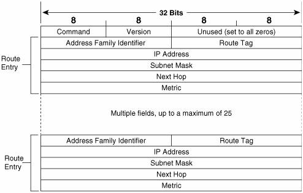

---
title: "AVS - CV7: RIP"
author: [Jakub Hrabovský, Martin Kontšek]
date: "2017-03-30"
...

# AVS - CV7: RIP

## Teoretická časť

- hlavnou témou je [RIPv2](http://learningnetworkingblog.blogspot.sk/2014/05/routing-information-protocol-rip.html) [(RFC 2453)](https://tools.ietf.org/html/rfc2453) => analyzujem štruktúru správy (veľkosť a typ jej položiek).
- RIPv2 správy sú posielané vždy na multicastovú IP adresu `224.0.0.9` a `UDP/520` => použijem IGMP, aby som sa prihlásil na odber správ smerovaných do tejto skupiny.

## Praktická časť - Program

- vytvorím program pre príjem správ protokolu __RIPv2__ a spracujem ich obsah (vypíšem na obrazovku kľúčové informácie v prehľadnom formáte).
- okrem údajov, któré obsahuje RIP správa vypíšem aj ďalšie informácie, napr. _IP_ adresu odosielateľa RIP správy.
- pre IP adresy v štruktúre použijem priamo typ `struct in_addr` => lepšia manipulácia bez zmeny veľkosti položky.
- **[!]** vždy uvediem `__attribute__((packed))` pre štruktúry, ktoré predstavujú hlavičky správ posielaných cez sieť.

- po prijatí a pred spracovaním overím __správnosť__ (valídnosť) prijatej RIP správy.
    + správa musí obsahovať aspoň 1 prefix.
    + veľkosť tela správy (bez RIP hlavičky) musí byť celočíselný násobok veľkosti 1 záznamu pre prefixy/siete.
    + typ (CMD) správy => chcem len _RIP odpovede_ (`CMD == 0x02`).
    + adresná rodina správy => spracujem len záznamy, ktoré majú __AF_ID == AF_INET__ (`0x02`), teda záznamy pre IPv4 prefixy.

- ak správa obsahuje viacero záznamov (prefixov), postupne prejdem každým z nich => použijem __smerníkovú aritmetiku__ podobne ako pre jednoduché údajové typy (napr. polia) => ak `entry` je smerník na štruktúru záznamu a ukazuje na začiatok konkrétneho záznamu, potom na začiatok ďalšieho záznamu v poradí prejdem cez `entry++` (k aktuálnej adrese tak pripočítam veľkosť typu smerníka).

- __[!]__ `inet_ntoa()` používa __statickú__ premennú => každé volanie premaže výsledok z predchádzajúceho volania => ak potrebujem viackrát za sebou zavolať funkciu, výsledky si musím zakaždým prekopírovať do vlastnej pamäte (premennej).
    + odporúčam používať fciu `inet_ntop()`.
- __[!]__ vo výpise `printf()` použijem pre hodnoty typu _unsigned_ formát `%u` (pre int) a `%hu` (pre short).

### Poznámky

- farebné výpisy na obrazovku => [TU](http://stackoverflow.com/questions/3585846/color-text-in-terminal-aplications-in-unix)
- formátovacie znaky pre výpis na obrazovku cez fcie skupiny `printf()` => [TU](http://www.cplusplus.com/reference/cstdio/printf/)

## Rozširujúce úlohy

- **Úloha 1** = rozšírte program o nové vlákno, ktoré odosiela RIP správy s vlastným obsahom => ohlasujte siete s prefixami _10.XX.AA.0/24_, kde _XX_ je najnižší bajt vašej IP addresy a _AA_ je z (0..255) => odosielajte správy na broadcast (RIPv1) alebo na multicast adresu (RIPv2).
    + __[!]__ pri tvorbe záznamov RIP správy použite pre všetky viacbajtové položky _network byte order_.
    + zvoľte vhodný postup generovania prefixov:
        1. vytvorím prvú (štartovaciu) sieť klasickým spôsobom => preložím text na číslo.
        2. ďalšie prefixy tvorím tak, že pripočítavám k číslu z bodu 1 vhodný krok (__[!]__ krok musím zakaždým prehodiť do _network byte order_ cez `htonl()` pred pripočítaním).
    + __[!]__ max počet prefixov v 1 RIP správe je __25__ => pre generovanie veľa prefixov (>25) musím rozdeliť záznamy do viacerých správ => upravím program tak, aby generoval správy podľa počtu záznamov, ktoré chcem odoslať (__max 25 záznamov per správu__) => poslednú správu (<25 záznamov) odošlem samostatne.
    + generujte RIP správy pravidelne každých _N_ sekúnd.
